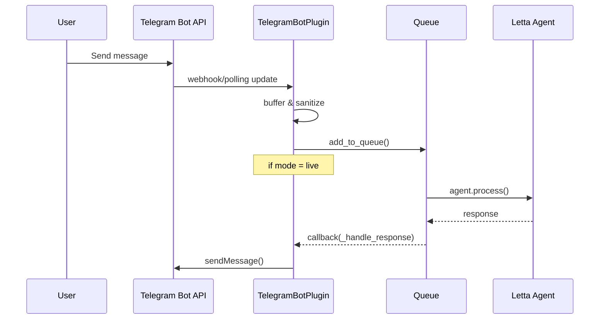

# ⚠️ REPOSITORY MOVED ⚠️

**This repository has moved to: [http://github.com/sanctumos/broca](http://github.com/sanctumos/broca)**

Please update your git remotes and use the new repository location for all future development and contributions.

---

# Telegram Bot Plugin (aiogram)

## Overview
The **Telegram Bot Plugin** brings native Telegram bot capabilities to Sanctum: Broca 2.  
It is implemented with [aiogram](https://github.com/aiogram/aiogram) and fully complies with the Broca plugin interface so it can be started, stopped and monitored by the core `PluginManager`.

* Repository path: `broca2/plugins/telegram_bot/`
* Entry-point: [`telegram_bot/plugin.py`](../plugins/telegram_bot/plugin.py)
* Main classes:
  * `TelegramBotPlugin` – concrete Broca plugin
  * `MessageHandler` – high-level routing for incoming messages
  * `MessageBuffer` – per-user buffering and batch flushing

---

## Quick-Start
1. **Install dependencies** (if you have not installed Broca in *editable* mode already):
   ```bash
   pip install -e .[telegram]
   ```
   The *`[telegram]`* extra installs `aiogram>=3`.

2. **Configure environment** – create/update your `.env` file (or system env-vars):
   ```env
   TELEGRAM_BOT_TOKEN=123456:ABC-DEF…
   # One of the following **must** be provided:
   TELEGRAM_OWNER_ID=987654321          # numeric user id (preferred)
   # or
   TELEGRAM_OWNER_USERNAME=my_username  # without the leading @

   # Optional overrides
   TELEGRAM_MESSAGE_MODE=echo|listen|live   # default: echo
   TELEGRAM_BUFFER_DELAY=5                 # seconds – default: 5
   ```

3. **Run Broca** (the plugin is auto-discovered/loaded by your runtime or via CLI):
   ```bash
   python -m broca2.main  # or whichever entry-point you use
   ```

   On startup you should see log lines similar to:
   ```text
   INFO PluginManager Loaded plugin: telegram_bot
   INFO TelegramBotPlugin initialized
   INFO Telegram bot started
   ```

---

## Usage
### Supported Commands
* `/start` – Greets the user and confirms the bot is running.
* `/help` – Shows a short command reference.

Any **other messages** are processed according to the current `message_mode` (see below).

### Message Modes
| Mode   | Behaviour                                                                    |
|--------|-------------------------------------------------------------------------------|
| echo   | The plugin echoes every received private message back to the sender.          |
| listen | Messages are stored in the database/queue but **no response** is sent.        |
| live   | Messages are passed to the Letta agent pipeline; the agent's response is sent |

Change the mode at runtime with the Broca CLI:
```bash
broca-admin settings set TELEGRAM_MESSAGE_MODE live
```

### Buffering
`MessageBuffer` groups consecutive messages from the same user within the `TELEGRAM_BUFFER_DELAY` window and sends them to the queue as a single combined entry. This reduces the number of round-trips to the agent and avoids flooding.

---

## Configuration Reference
| Variable | Required | Default | Description |
|----------|----------|---------|-------------|
| `TELEGRAM_BOT_TOKEN` | ✅ | – | Bot token from BotFather. |
| `TELEGRAM_OWNER_ID` | ⚠️* | – | Numeric Telegram user id of the bot owner. |
| `TELEGRAM_OWNER_USERNAME` | ⚠️* | – | Username of the bot owner (without `@`). |
| `TELEGRAM_MESSAGE_MODE` | ❌ | `echo` | `echo`, `listen` or `live`. |
| `TELEGRAM_BUFFER_DELAY` | ❌ | `5` | Seconds to wait before flushing the buffer. |

⚠️ *Exactly **one** of `TELEGRAM_OWNER_ID` *or* `TELEGRAM_OWNER_USERNAME` must be provided to restrict bot usage to the owner.*

---

## Event Flow


---

## Testing
The plugin ships with pytest suites in `broca2/plugins/telegram_bot/tests/`.
Run:
```bash
pytest broca2/plugins/telegram_bot/tests -q
```

---

## Troubleshooting
* **`RuntimeError: TimeoutError`** –  Check internet connectivity and that the bot token is correct.
* **`Unauthorized user` log entries** – Verify you set `TELEGRAM_OWNER_ID` or `TELEGRAM_OWNER_USERNAME` to match your account.
* **No messages are processed in `live` mode** – Ensure the QueueProcessor and Letta agent service are both running.

---

## Extending
If you need additional command handlers, register them in `TelegramBotPlugin.start()` by adding extra `Dispatcher.message.register(...)` calls before polling starts.

Feel free to consult the source code – it is well-commented and only ~250 LoC.