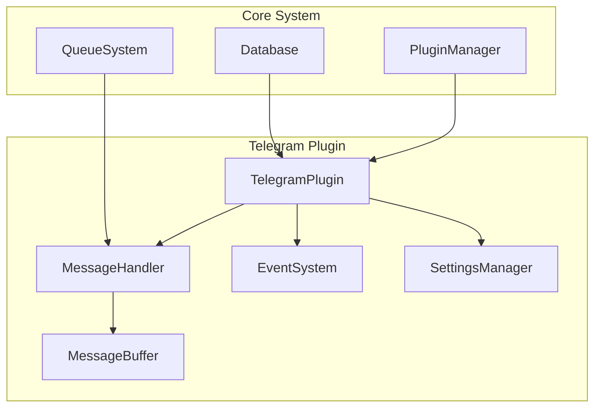
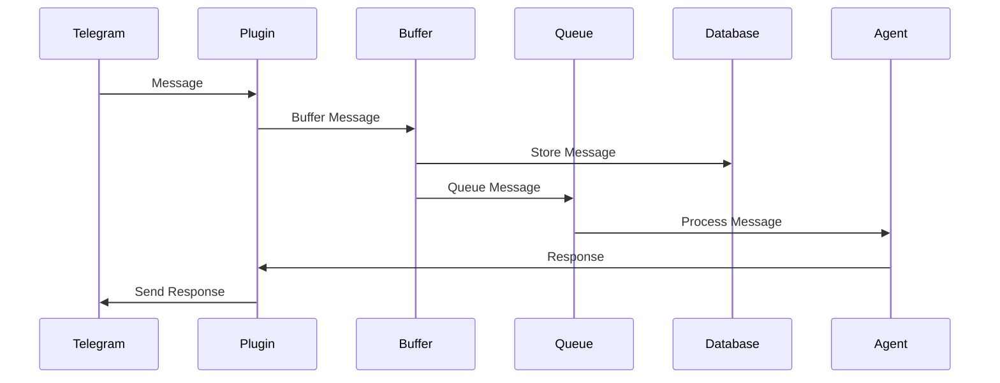
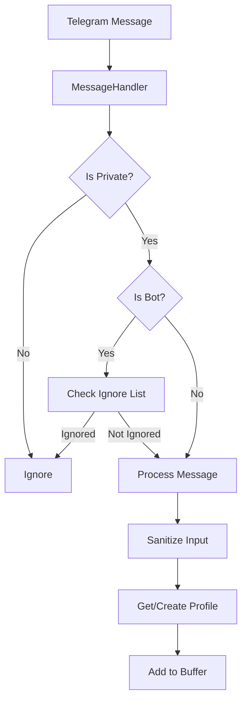
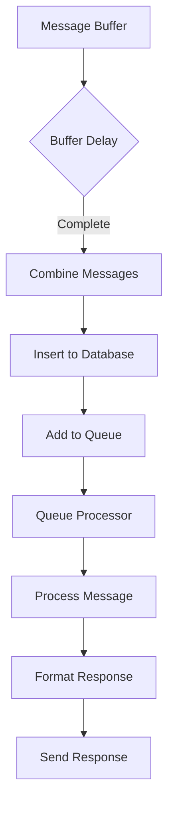

---

# Telegram Plugin Specification

## System Context

### 1. Broca Ecosystem Integration
- **Core System Dependencies**
  - Queue System: Handles message processing and delivery
  - Database System: Manages user profiles and message storage
  - Plugin Manager: Coordinates plugin lifecycle and event routing
  - Agent System: Processes messages and generates responses

- **Integration Points**
  ```mermaid
  graph TD
      A[Telegram Plugin] --> B[Plugin Manager]
      B --> C[Queue System]
      B --> D[Database System]
      C --> E[Agent System]
      D --> F[User Profiles]
      D --> G[Message Storage]
  ```

### 2. System Constraints
- **Resource Limitations**
  - Memory: 512MB per plugin instance
  - CPU: 1 core dedicated
  - Storage: 1GB message history
  - Network: 1000 messages/minute

- **Performance Requirements**
  - Message processing: < 100ms
  - Response time: < 2s
  - Buffer flush: < 5s
  - Database operations: < 50ms

### 3. Security Context
- **Authentication Flow**
  ```mermaid
  sequenceDiagram
      participant U as User
      participant T as Telegram
      participant P as Plugin
      participant C as Core
      U->>T: Send Message
      T->>P: Forward Message
      P->>C: Verify User
      C->>P: Auth Result
      P->>T: Process/Reject
  ```

## Business Requirements

### 1. Functional Requirements
- **Message Handling**
  - Support for private messages
  - Bot message filtering
  - Message buffering and batching
  - Response formatting

- **User Management**
  - User profile creation
  - Platform ID mapping
  - Username tracking
  - Display name management

- **Bot Management**
  - Configurable ignore list
  - Bot verification
  - Message filtering
  - Status tracking

### 2. Non-Functional Requirements
- **Performance**
  - 99.9% uptime
  - < 2s response time
  - < 100ms processing time
  - Support for 1000 concurrent users

- **Scalability**
  - Horizontal scaling support
  - Load balancing capability
  - Resource optimization
  - State management

- **Reliability**
  - Automatic recovery
  - Error handling
  - Data consistency
  - State persistence

### 3. Compliance Requirements
- **Data Protection**
  - Message encryption
  - User data protection
  - Session security
  - Access control

- **Audit Requirements**
  - Message logging
  - User activity tracking
  - Error logging
  - Performance monitoring

## Technical Design

### 1. Component Architecture


### 2. Data Flow


### 3. State Management
- **Session State**
  - Authentication state
  - Connection state
  - User context
  - Message context

- **Buffer State**
  - Message accumulation
  - Flush scheduling
  - Error recovery
  - State persistence

## Operational Design

### 1. Deployment Architecture
- **Component Distribution**
  - Plugin instances
  - Database nodes
  - Queue workers
  - Agent instances

- **Scaling Strategy**
  - Horizontal scaling
  - Load distribution
  - Resource allocation
  - State synchronization

### 2. Monitoring Strategy
- **Metrics**
  - Message throughput
  - Response times
  - Error rates
  - Resource usage

- **Alerts**
  - Error thresholds
  - Performance degradation
  - Resource exhaustion
  - Security incidents

### 3. Backup and Recovery
- **Data Backup**
  - Message history
  - User profiles
  - Configuration
  - Session state

- **Recovery Procedures**
  - System restoration
  - Data recovery
  - State reconstruction
  - Service resumption

## Migration Strategy

### 1. Current System Analysis
- **Strengths**
  - Robust message handling
  - Efficient buffering
  - Flexible configuration
  - Strong error handling

- **Limitations**
  - Single-instance design
  - Limited scalability
  - Basic monitoring
  - Manual recovery

### 2. Migration Path
- **Phase 1: Preparation**
  - System assessment
  - Requirement gathering
  - Design validation
  - Resource allocation

- **Phase 2: Implementation**
  - Component development
  - Integration testing
  - Performance optimization
  - Security hardening

- **Phase 3: Deployment**
  - Staged rollout
  - Monitoring setup
  - Backup procedures
  - Rollback planning

### 3. Risk Assessment
- **Technical Risks**
  - Integration complexity
  - Performance impact
  - Data consistency
  - State management

- **Operational Risks**
  - Service disruption
  - Data loss
  - Performance degradation
  - Security vulnerabilities

## Testing Strategy

### 1. Test Categories
- **Unit Tests**
  - Component testing
  - Function testing
  - Error handling
  - State management

- **Integration Tests**
  - System integration
  - API testing
  - Database operations
  - Event handling

- **Performance Tests**
  - Load testing
  - Stress testing
  - Endurance testing
  - Scalability testing

### 2. Test Environment
- **Development**
  - Local testing
  - Component isolation
  - Mock services
  - Debug tools

- **Staging**
  - System integration
  - Performance testing
  - Security testing
  - User acceptance

- **Production**
  - Canary deployment
  - A/B testing
  - Monitoring
  - Rollback capability

## Future Roadmap

### 1. Short-term Goals
- Group chat support
- Media message handling
- Command system
- Rate limiting

### 2. Medium-term Goals
- Multiple instance support
- Advanced bot filtering
- Enhanced monitoring
- Automated recovery

### 3. Long-term Goals
- Global scaling
- Advanced analytics
- AI integration
- Platform expansion

## Overview
The Telegram plugin is a robust integration module that handles all Telegram-specific functionality within the Broca system. It provides a complete interface for message handling, user management, and platform-specific features while maintaining clean separation from the core system.

## Core Components

### 1. TelegramPlugin (`telegram_plugin.py`)
The main plugin class that implements the platform interface.

#### Key Features
- **Session Management**
  - Uses Telethon's StringSession for persistent authentication
  - Auto-saves session state
  - Handles authorization and reconnection

- **Message Processing**
  - Asynchronous message handling
  - Typing indicators during response
  - Message formatting and sanitization
  - Error handling and status updates

- **Bot Management**
  - Configurable bot ignore list
  - JSON-based ignore list storage
  - Dynamic ignore list reloading
  - Username and ID-based filtering

#### Configuration
```python
class TelegramSettings:
    api_id: str
    api_hash: str
    session_string: Optional[str]
    message_mode: MessageMode
    buffer_delay: int
    auto_save_session: bool
```

### 2. MessageHandler (`handlers.py`)
Handles the core message processing logic.

#### Components
- **MessageBuffer**
  - Configurable delay-based buffering
  - Batch message processing
  - Per-user message aggregation
  - Automatic flush scheduling

- **Message Processing**
  - Private message filtering
  - Bot message filtering
  - User input sanitization
  - Profile management

#### Message Modes
```python
class MessageMode(Enum):
    ECHO = 'echo'    # Echo messages back
    LISTEN = 'listen' # Process without response
    LIVE = 'live'    # Full processing and response
```

### 3. Event System
- **Event Types**
  - Message reception
  - Response handling
  - Error events
  - Status updates

- **Handler Registration**
  - Dynamic event handler registration
  - Multiple handlers per event type
  - Error isolation between handlers

## Message Flow

### 1. Message Reception


### 2. Message Processing


## Database Integration

### 1. User Management
- Platform profile creation/retrieval
- User ID mapping
- Username tracking
- Display name management

### 2. Message Storage
- Message content storage
- Timestamp tracking
- Status management
- Response storage

## Error Handling

### 1. Message Processing Errors
- Invalid user IDs
- Message formatting failures
- Database operation failures
- Network issues

### 2. Recovery Mechanisms
- Automatic retry logic
- Error status updates
- Detailed error logging
- Graceful degradation

## Configuration Management

### 1. Environment Variables
```env
TELEGRAM_API_ID=your_api_id
TELEGRAM_API_HASH=your_api_hash
TELEGRAM_SESSION_STRING=optional_session_string
TELEGRAM_MESSAGE_MODE=echo|listen|live
TELEGRAM_BUFFER_DELAY=5
TELEGRAM_AUTO_SAVE_SESSION=true
```

### 2. Ignore List
```json
{
    "bot_id": {
        "username": "bot_username",
        "reason": "ignore_reason"
    }
}
```

## Security Considerations

### 1. Authentication
- Secure session management
- API key protection
- Session string encryption

### 2. Input Validation
- Message sanitization
- User input validation
- Bot verification

### 3. Access Control
- Private message filtering
- Bot message filtering
- User verification

## Performance Considerations

### 1. Message Buffering
- Configurable delay
- Batch processing
- Memory-efficient storage

### 2. Asynchronous Operations
- Non-blocking message handling
- Concurrent processing
- Efficient resource usage

## Integration Points

### 1. Core System
- Plugin interface implementation
- Event system integration
- Queue system integration

### 2. Database
- User profile management
- Message storage
- Status tracking

### 3. External Services
- Telegram API integration
- Session management
- Message delivery

## Future Considerations

### 1. Potential Enhancements
- Group chat support
- Media message handling
- Command system
- Rate limiting
- Advanced bot filtering

### 2. Scalability
- Multiple instance support
- Load balancing
- Resource optimization

## Testing Requirements

### 1. Unit Tests
- Message handling
- User management
- Error handling
- Configuration management

### 2. Integration Tests
- API integration
- Database operations
- Event system
- Queue processing

### 3. Performance Tests
- Message buffering
- Concurrent processing
- Resource usage
- Response times 